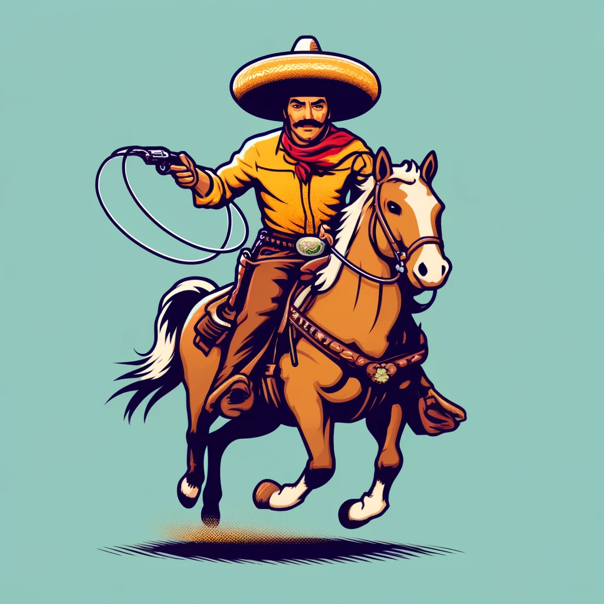
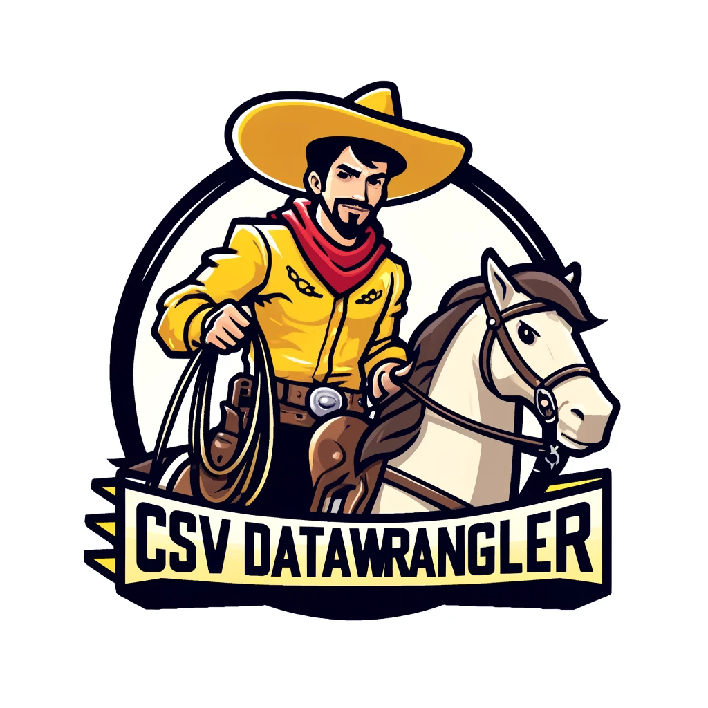
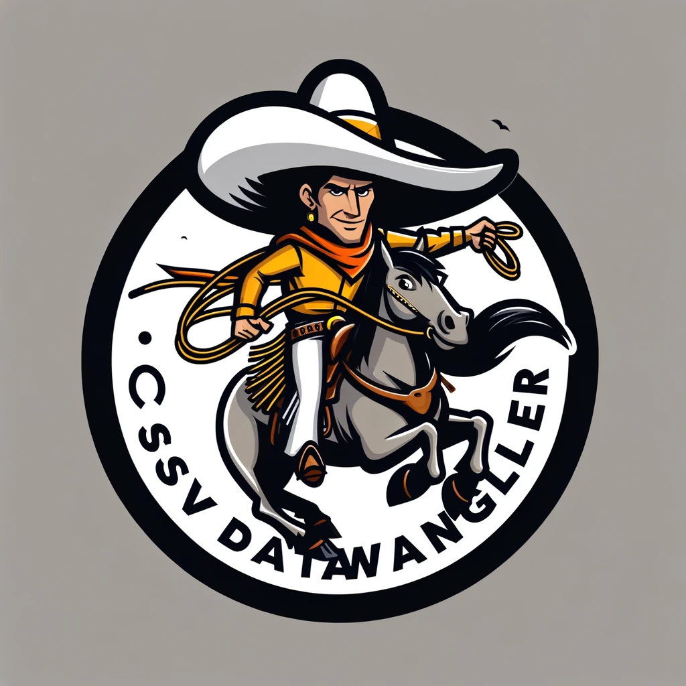
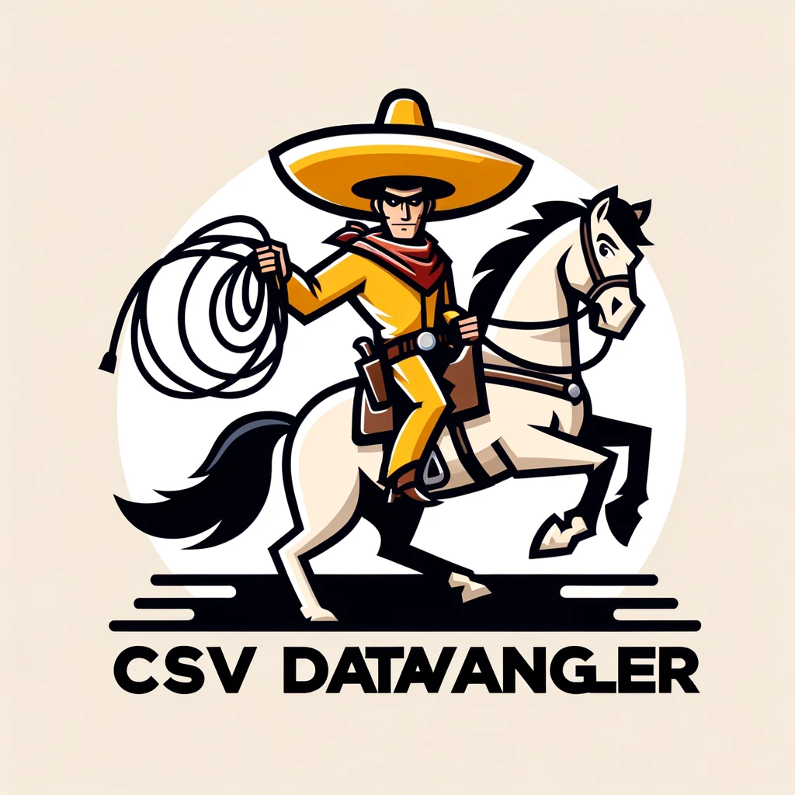
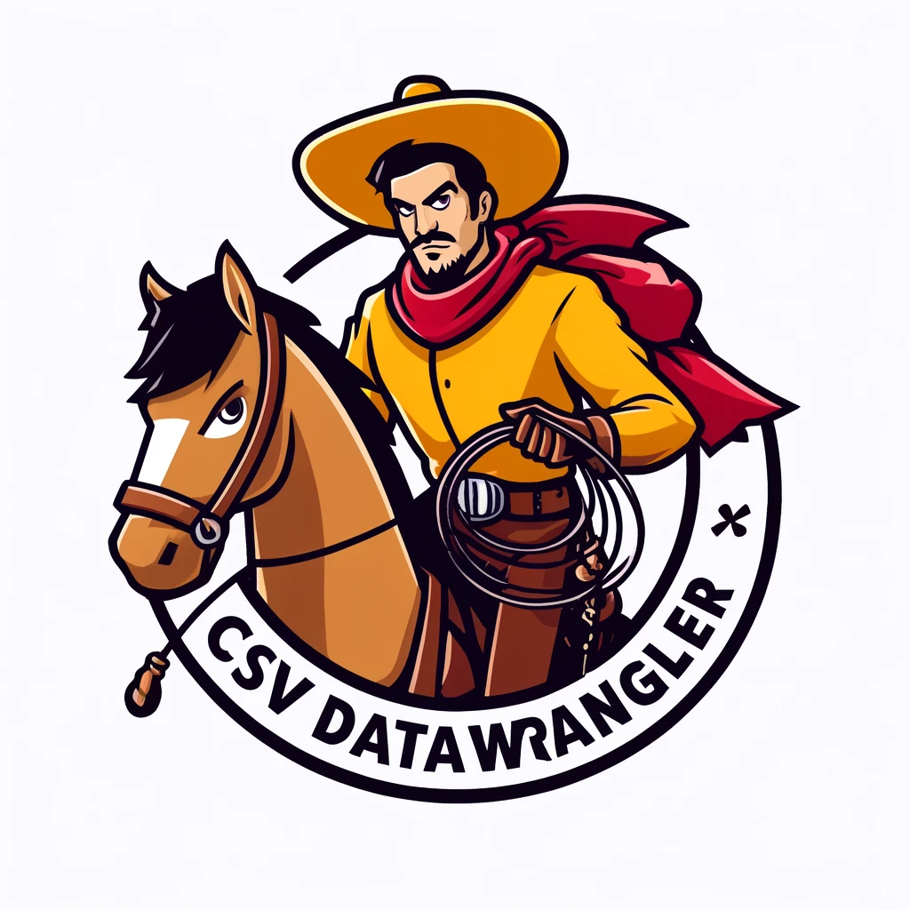

# csv,conf,v8-2024 logos

To break the ice during my talk at csv,conf,v8-2024, I decided to create fun, conference-themed logos using ChatGPT 4o.

These logos were generated by providing the original qsv logo to ChatGPT 4o and asking it to generate a new logo based on the original. The results are quite interesting and were generated using the following prompt sequence:

**Original qsv logo**:

   
   > Can you modify the logo so the rider looks like Speedy Gonzales? 

**Logo 1**:

   
   > Keep the general outline of the logo. Also, make it look like the cartoon character "Speedy Gonzales"  

**Logo 2**:

   
   > Please create another version that looks more like the original. This time, only change the rider so it looks like the Looney Tunes cartoon character "Speedy Gonzales"

**Logo 3**:
   
   > Nice! Can you correct the spelling of "CSSV DATAWANGLLER" and change it to "CSV DATAWRANGLER"?

**Logo 4**:
   
   > It's still mispelled!

**Logo 5 & 6**:  
   Somehow, it generated two logos for the last prompt. It first generated Logo 5, and as I was typing that it was still mispelled, it generated Logo 6 unprompted!  
   Here they are:
   
   

My favorites are Logo 3 and 5. Which one do you like the most?
